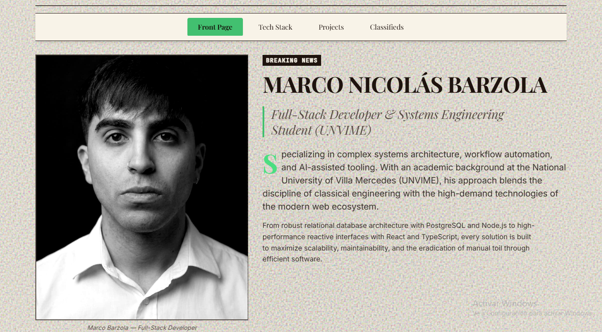

# Portafolio - Marco Nicolás Barzola

Este es el repositorio de mi portafolio personal, diseñado con una estética de periódico. Aquí presento mis proyectos, habilidades técnicas y experiencia como desarrollador.



## 🌟 Características Destacadas

*   **Diseño Temático:** Interfaz de usuario inspirada en un periódico clásico ("Morning/Night Edition").
*   **Soporte Bilingüe:** La página cuenta con un selector de idioma (ES/EN) para llegar a una audiencia más amplia.
*   **Modo Claro/Oscuro:** Transición fluida entre temas para mejorar la experiencia de lectura.
*   **Descarga de CV Dinámica:** El currículum se descarga automáticamente en el idioma en el que se esté visualizando la página (Inglés o Español).

## 🛠️ Tecnologías Utilizadas

*   **Lenguajes:** JavaScript/TypeScript
*   **Frontend:** React.js, Tailwind CSS 
*   **Herramientas:** Git, GitHub

## 🚀 Cómo ejecutar el proyecto localmente

Si deseas correr este proyecto en tu entorno local, sigue estos pasos:

1. Clona el repositorio:
   ```bash
   git clone https://github.com/MarcoBarzola22/MiPortafolio.git
   ```

2. Instala las dependencias:
   ```bash
   npm install
   ```

3. Inicia el servidor de desarrollo:
   ```bash
   npm run dev
   ```

## 📫 Contacto

Si te interesa mi trabajo o quieres que colaboremos en un proyecto, no dudes en contactarme:

*   **LinkedIn:** [Marco Nicolás Barzola](https://www.linkedin.com/in/marco-nicolás-barzola-789a8a341)
*   **Email:** [marcobarzoladev@gmail.com](mailto:marcobarzoladev@gmail.com)
