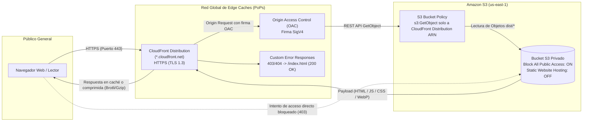
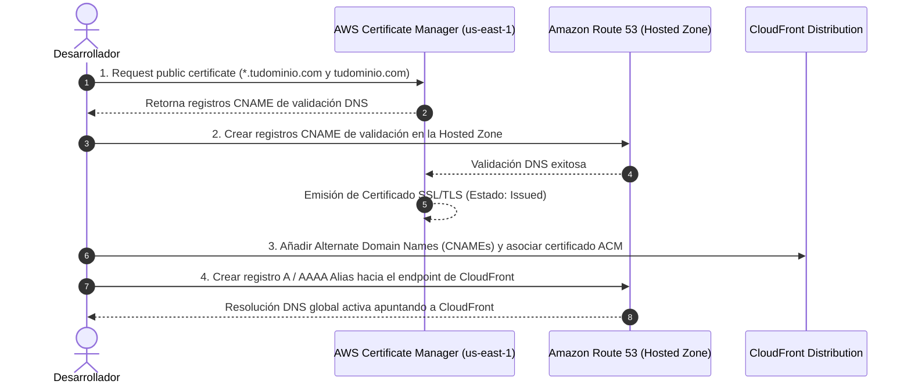

# SPEC-005: Infraestructura y Despliegue en AWS (S3 + CloudFront + OAC)

**Estado:** Aprobado para Planificación  
**Fase:** 5  
**Fecha:** 2026-09-25  
**Constitución aplicable:** [docs/constitution.md](../../docs/constitution.md) — Principio 6 (*"SPA desplegable en AWS. Arquitectura en React 19 y Vite orientada a un build estático limpio, listo para ser desplegado eficientemente en la nube (S3 + CloudFront). `npm run build` sin warnings ni errores."*)  
**Reglas operativas:** [AGENTS.md](../../AGENTS.MD) — Reglas 1, 2, 5  

---

## 1. Contexto y Objetivos

### 1.1 Contexto
Una vez completadas con éxito las fases de diseño editorial, optimización tipográfica OKLCH, casos de estudio interactivos e internacionalización bilingüe (i18n), el portafolio (*The Minty Gazette*) se encuentra listo para salir del entorno local y ser publicado a escala mundial en internet.

El despliegue en la nube debe cumplir de forma intransigente con el **Principio 6 de la Constitución**, garantizando una arquitectura de alto rendimiento, costos operativos prácticamente nulos (aprovechando la capa gratuita de AWS) y los estándares de seguridad perimetral más rigurosos de la industria.

### 1.2 Objetivos de la Especificación
1. **Seguridad Estricta de Almacenamiento:** Alojar los activos estáticos compilados en un bucket privado de **Amazon S3** con *Block all public access* activado al 100%, impidiendo cualquier acceso directo anónimo a través de URLs de S3 o endpoints web públicos no autenticados.
2. **Distribución Global y Aceleración Edge:** Distribuir el contenido mediante **Amazon CloudFront** utilizando **Origin Access Control (OAC)**, el protocolo moderno de autenticación criptográfica basado en AWS SigV4 que autoriza exclusivamente a la distribución de CloudFront a leer objetos del bucket.
3. **Soporte Nativo de SPA (Single Page Application):** Resolver el enrutamiento del lado del cliente configurando respuestas de error personalizadas (*Custom Error Responses*) en CloudFront para que cualquier solicitud a rutas internas o recargas de página resuelva en `index.html` con código HTTP 200.
4. **Gobierno Quirúrgico de Caché:** Diferenciar los encabezados de control de caché entre archivos inmutables con hash (`/assets/*`) y el punto de entrada dinámico (`index.html`), aplicando una estrategia de invalidación quirúrgica para minimizar la rotación en los Edge PoPs y mantenerse holgadamente dentro de los límites gratuitos de AWS.
5. **Ruta de Escalabilidad a Dominio Propio:** Dejar definido el procedimiento desacoplado y paso a paso para acoplar posteriormente un dominio personalizado gestionado con **Route 53** y **AWS Certificate Manager (ACM)** sobre la infraestructura base desplegada.

---

## 2. Decisiones de Arquitectura y Parámetros Operativos

En base a la sesión de diseño técnico, se han definido los siguientes parámetros operativos:

| Parámetro | Decisión Adoptada | Justificación Técnica y Trade-offs |
|---|---|---|
| **Región S3 Principal** | `us-east-1` (N. Virginia) | Máxima compatibilidad y co-ubicación con los servicios globales de AWS (CloudFront, ACM). Menores costes base de transferencia y latencia reducida en llamadas al plano de control de CloudFront. |
| **Seguridad de Acceso al Origen** | Origin Access Control (OAC) | OAC sustituye al mecanismo legado OAI (Origin Access Identity). Soporta firmas SigV4, cifrado SSE-KMS si se requiriese a futuro, y elimina la necesidad de habilitar *Static Website Hosting* en S3. |
| **Estrategia de Invalidación** | Quirúrgica (`/index.html` y raíz sin hash) | Los assets generados por Vite (`dist/assets/*.js`, `dist/assets/*.css`) contienen hashes de contenido únicos (`[name]-[hash].ext`). Son inmutables en caché de navegador y CloudFront (TTL de 1 año). Solo `index.html` (y metadatos raíz) requiere invalidación inmediata ante nuevos despliegues, protegiendo la cuota mensual gratuita de 1.000 rutas. |
| **Dominio y Certificado SSL (Fase Inicial)** | Dominio por defecto CloudFront (`*.cloudfront.net`) | Permite desplegar y verificar de inmediato la topología OAC + S3 con HTTPS nativo sin costes fijos de Hosted Zones en Route 53 ($0.50 USD/mes) ni dependencia de la compra o delegación de un dominio externo. |
| **Migración Futura a Dominio Propio** | Plan documentado para Route 53 + ACM | Procedimiento modular listo para ser ejecutado cuando se adquiera el dominio definitivo, manteniendo intacta la infraestructura de S3 y OAC ya desplegada. |

---

## 3. Topología de Red y Flujo de Tráfico

### 3.1 Diagrama de Arquitectura (Mermaid)



### 3.2 Principios de Seguridad Perimetral
1. **Aislamiento Total del Bucket:** El bucket S3 no tiene activado el módulo de *Static Website Hosting*. Responde únicamente a la API REST de S3.
2. **Cero Acceso Público:** Todas las 4 configuraciones de *Block Public Access* permanecen activadas (`true`). No existen permisos ACL ni políticas públicas anónimas.
3. **Autenticación Condicional Estricta:** La política del bucket autoriza exclusivamente al servicio `cloudfront.amazonaws.com` y condiciona la concesión al ARN exacto de la distribución de CloudFront (`aws:SourceArn`). Ninguna otra distribución ni cuenta de AWS puede leer los objetos.

---

## 4. Guía de Configuración Manual en la Consola de AWS

Esta sección define el procedimiento exacto paso a paso para la creación y orquestación de recursos en la consola web de AWS.

### 4.1 Paso 1: Creación del Bucket S3 en `us-east-1`
1. Iniciar sesión en la consola de AWS y dirigirse a **Amazon S3**.
2. Hacer clic en **Create bucket**.
3. Configurar los campos obligatorios:
   - **Bucket name:** Un nombre descriptivo y globalmente único (ej. `marcobarzola-portfolio-web` o `minty-gazette-spa-prod`).
   - **AWS Region:** `us-east-1` (US East - N. Virginia).
   - **Object Ownership:** Seleccionar **ACLs disabled (recommended)** (garantiza que todos los objetos pertenezcan a la cuenta de AWS).
   - **Block Public Access settings for this bucket:**
     - Marcar la casilla general **Block *all* public access**.
     - Verificar que las 4 opciones subordinadas queden marcadas:
       - *Block public access to buckets and objects granted through new access control lists (ACLs)*.
       - *Block public access to buckets and objects granted through any access control lists (ACLs)*.
       - *Block public access to buckets and objects granted through new public bucket or access point policies*.
       - *Block public and cross-account access to buckets and objects through any public bucket or access point policies*.
   - **Bucket Versioning:** Dejar en *Disabled* (o *Enabled* si se desean conservar versiones históricas de los builds).
   - **Default encryption:**
     - Encryption type: **Amazon S3-managed keys (SSE-S3)**.
     - Bucket Key: *Enable*.
4. Hacer clic en **Create bucket**.
5. **Verificación crítica:** Acceder a la pestaña **Properties** del bucket recién creado, desplazarse hasta el final (*Static website hosting*) y constatar que se encuentra en **Disabled**.

---

### 4.2 Paso 2: Creación de la Distribución de CloudFront con OAC
1. Navegar al servicio **CloudFront** en la consola de AWS.
2. Hacer clic en **Create distribution**.
3. Configurar la sección **Origin**:
   - **Origin domain:** Seleccionar del menú desplegable el bucket S3 creado en el Paso 1 (la consola mostrará el endpoint REST con formato `nombre-del-bucket.s3.us-east-1.amazonaws.com`).
   - **Origin path:** Dejar en blanco.
   - **Name:** Dejar el valor autocompletado o asignar un nombre legible (ej. `S3-minty-gazette`).
   - **Origin access:**
     - Seleccionar la opción **Origin access control settings (recommended)**.
     - En el menú desplegable de control de acceso de origen, hacer clic en **Create new OAC** (o *Create control setting*):
       - *Name:* `OAC-minty-gazette`
       - *Description:* Control de acceso para el bucket S3 del portafolio.
       - *Signing behavior:* **Sign requests (recommended)**.
       - *Origin type:* **S3**.
       - Hacer clic en **Create**.
     - Seleccionar el OAC recién creado en el desplegable.
     - *Aviso:* La consola mostrará un banner azul advirtiendo que se debe actualizar la política del bucket S3 una vez creada la distribución.
4. Configurar la sección **Default cache behavior**:
   - **Compress objects automatically:** **Yes** (habilita compresión Gzip y Brotli automática en los bordes).
   - **Viewer protocol policy:** **Redirect HTTP to HTTPS** (fuerza navegación segura).
   - **Allowed HTTP methods:** `GET, HEAD` (suficiente para una SPA estática).
   - **Restrict viewer access:** **No**.
   - **Cache key and origin requests:**
     - Seleccionar **Cache policy and origin request policy (recommended)**.
     - *Cache policy:* Seleccionar la política gestionada **CachingOptimized**.
     - *Origin request policy:* Dejar en *None*.
     - *Response headers policy:* Dejar en *None* (o asociar política de encabezados de seguridad opcional).
5. Configurar la sección **Function associations**:
   - Dejar todos los eventos en *No association*.
6. Configurar la sección **Settings**:
   - **Price class:** Seleccionar **Use all edge locations (best performance)** o **Use North America and Europe** (según preferencia geográfica).
   - **Alternate domain name (CNAME):** Dejar vacío en esta fase inicial.
   - **Custom SSL certificate:** Dejar deshabilitado (se usará el certificado por defecto `*.cloudfront.net`).
   - **Supported HTTP versions:** HTTP/2, HTTP/3 activados.
   - **Default root object:** Escribir exactamente `index.html`.
   - **Standard logging:** Off.
7. Hacer clic en **Create distribution**.

---

### 4.3 Paso 3: Aplicación de la Política de Acceso al Bucket S3 (Bucket Policy)
Inmediatamente tras la creación, CloudFront mostrará un banner informativo con el botón **Copy policy**. La política generada debe aplicarse en S3:

1. Regresar a **Amazon S3** > Abrir el bucket creado en el Paso 1 > Ir a la pestaña **Permissions**.
2. Desplazarse hasta la sección **Bucket policy** y hacer clic en **Edit**.
3. Pegar la política JSON de acceso restringido por OAC, adaptada con el ARN del bucket y el ARN de la distribución de CloudFront:

```json
{
  "Version": "2012-10-17",
  "Statement": [
    {
      "Sid": "AllowCloudFrontServicePrincipalReadOnly",
      "Effect": "Allow",
      "Principal": {
        "Service": "cloudfront.amazonaws.com"
      },
      "Action": "s3:GetObject",
      "Resource": "arn:aws:s3:::<NOMBRE-DEL-BUCKET>/*",
      "Condition": {
        "StringEquals": {
          "AWS:SourceArn": "arn:aws:cloudfront::<ACCOUNT-ID>:distribution/<DISTRIBUTION-ID>"
        }
      }
    }
  ]
}
```

4. Reemplazar los valores marcados:
   - `<NOMBRE-DEL-BUCKET>`: Nombre real del bucket S3 creado.
   - `<ACCOUNT-ID>`: ID de 12 dígitos de la cuenta de AWS.
   - `<DISTRIBUTION-ID>`: ID alfanumérico de la distribución de CloudFront (ej. `E1A2B3C4D5E6F7`).
5. Hacer clic en **Save changes**.

---

### 4.4 Paso 4: Enrutamiento SPA (Custom Error Responses en CloudFront)
Dado que una SPA gestiona rutas internas en el navegador (como `/` o posibles anclas y subpáginas), cualquier solicitud directa a una ruta inexistente como archivo físico en S3 provocaría un error HTTP 403 (Access Denied por OAC) o HTTP 404 (NoSuchKey). Para garantizar recargas limpias:

1. En la consola de **CloudFront**, seleccionar la distribución creada.
2. Hacer clic en la pestaña **Error pages** (o *Custom error responses*).
3. Hacer clic en **Create custom error response**.
4. Configurar la primera regla para el código **403**:
   - **HTTP error code:** `403: Forbidden`.
   - **Customize error response:** Seleccionar **Yes**.
   - **Response page path:** `/index.html`.
   - **HTTP response code:** `200: OK`.
   - **Error caching minimum TTL:** `0` (o `10` segundos).
   - Hacer clic en **Create custom error response**.
5. Repetir el proceso creando una segunda regla para el código **404**:
   - **HTTP error code:** `404: Not Found`.
   - **Customize error response:** Seleccionar **Yes**.
   - **Response page path:** `/index.html`.
   - **HTTP response code:** `200: OK`.
   - **Error caching minimum TTL:** `0` (o `10` segundos).
   - Hacer clic en **Create custom error response**.

---

## 5. Estrategia de Build, Carga de Archivos y Caché

### 5.1 Requisitos del Build Estático (Principio 6)
Antes de cargar los archivos al bucket S3, la aplicación debe compilarse en el entorno local verificando la ausencia total de advertencias críticas o errores:
- Comando de verificación: `npm run build`
- Directorio resultante de salida: `dist/`
- Verificaciones previas requeridas:
  - Ningún error de tipado TypeScript (`tsc -b`).
  - Bundle principal optimizado y dividido en chunks lógicos en `dist/assets/`.
  - Archivos estáticos auxiliares copiados fielmente en la raíz (`favicon.ico`, `robots.txt`, etc.).

### 5.2 Estrategia de Encabezados HTTP (Cache-Control) en S3
Para maximizar la tasa de aciertos en caché (*Cache Hit Ratio*) y posibilitar la invalidación quirúrgica, los objetos en S3 deben subirse con encabezados diferenciados:

| Categoría de Archivo | Rutas / Extensiones | Encabezado `Cache-Control` | Comportamiento en Navegador y PoPs |
|---|---|---|---|
| **Activos Inmutables Hasheados** | `assets/*.js`<br>`assets/*.css`<br>`assets/*.webp`<br>`assets/*.woff2` | `public, max-age=31536000, immutable` | Caché persistente durante 1 año. Nunca se re-solicitan porque su nombre cambiará si el código cambia. |
| **Punto de Entrada y Raíz** | `index.html`<br>`robots.txt`<br>`favicon.ico` | `public, max-age=0, must-revalidate` | El navegador y CloudFront siempre validan la frescura del archivo contra el origen. Si hay nueva versión, se sirve al instante. |

### 5.3 Procedimiento de Invalidación Quirúrgica en CloudFront
Cada vez que se suba una nueva versión de la aplicación compilada a S3:
1. Ir a la consola de **CloudFront** > Seleccionar la distribución.
2. Ir a la pestaña **Invalidations**.
3. Hacer clic en **Create invalidation**.
4. En el campo **Add object paths**, ingresar exclusivamente las rutas modificadas no hasheadas:
   ```text
   /index.html
   /robots.txt
   ```
5. Hacer clic en **Create invalidation**.
6. **Ventajas:**
   - La invalidación tarda menos de 15 segundos en propagarse globalmente.
   - No se purgan los megabytes de chunks de JavaScript y CSS que no hayan cambiado o que ya estén cacheados en navegadores de usuarios recurrentes.
   - Se consume exactamente 1 o 2 rutas del cupo mensual gratuito de 1.000 invalidaciones de AWS.

---

## 6. Procedimiento de Migración a Dominio Personalizado (Route 53 + ACM)

Esta sección documenta el plan modular para cuando se decida asignar un dominio propio (ej. `marcobarzola.dev` o `portfolio.marcobarzola.com`).



### 6.1 Paso A: Solicitud de Certificado SSL/TLS en ACM
> **Regla Crítica de AWS:** Para que CloudFront pueda utilizar un certificado SSL personalizado de AWS Certificate Manager, el certificado **DEBE solicitarse obligatoriamente en la región `us-east-1` (N. Virginia)**, con independencia de dónde resida la Hosted Zone de Route 53.

1. Cambiar la región de la consola de AWS a **us-east-1 (N. Virginia)**.
2. Navegar a **AWS Certificate Manager (ACM)** > **Request certificate**.
3. Seleccionar **Request a public certificate**.
4. En **Fully qualified domain name (FQDN)** ingresar:
   - Dominio ápice: `tudominio.com`
   - Subdominio comodín o específico: `*.tudominio.com` o `portfolio.tudominio.com`.
5. En **Validation method**, seleccionar **DNS validation (recommended)**.
6. Hacer clic en **Request**.

### 6.2 Paso B: Validación de Dominio en Route 53
1. Abrir el certificado recién solicitado en ACM.
2. En la sección **Domains**, hacer clic en el botón **Create records in Route 53**.
3. Seleccionar la zona alojada correspondiente y confirmar.
4. Route 53 insertará automáticamente los registros CNAME de comprobación. El estado del certificado pasará a **Issued** en pocos minutos.

### 6.3 Paso C: Actualización de la Distribución de CloudFront
1. Ir a **CloudFront** > Seleccionar la distribución del portafolio > Pestaña **General** > Hacer clic en **Edit**.
2. En **Alternate domain name (CNAME)**:
   - Añadir los dominios registrados (ej. `marcobarzola.dev`, `www.marcobarzola.dev`).
3. En **Custom SSL certificate**:
   - Seleccionar el certificado emitido en ACM (`us-east-1`).
4. En **Security policy**: Seleccionar la versión TLS recomendada: **TLSv1.2_2021** (o superior).
5. Guardar los cambios.

### 6.4 Paso D: Creación de Registros Alias en Route 53
1. Ir a **Route 53** > **Hosted zones** > Seleccionar la zona del dominio.
2. Hacer clic en **Create record**.
3. Para el dominio raíz (`tudominio.com`):
   - Record type: **A - Routes traffic to an IPv4 address and some AWS resources**.
   - Activar la casilla **Alias**.
   - *Route traffic to:* **Alias to CloudFront distribution**.
   - Seleccionar la distribución de CloudFront del portafolio.
   - Routing policy: **Simple routing**.
   - Hacer clic en **Define simple record**.
4. (Recomendado) Repetir creando un registro **AAAA** con Alias para habilitar IPv6 nativo.
5. Repetir para el subdominio `www` si aplica.

---

## 7. Criterios de Aceptación y Checklist de Verificación (DoD)

Para dar por concluida satisfactoriamente la Fase 5 una vez ejecutadas las acciones en la consola de AWS, deben cumplirse las siguientes condiciones:

### 7.1 Seguridad y Privacidad
- [ ] El bucket S3 tiene las 4 casillas de *Block all public access* activadas.
- [ ] Intentar acceder directamente a un objeto vía URL de S3 (`https://<bucket>.s3.us-east-1.amazonaws.com/index.html`) devuelve estrictamente `403 Forbidden` o `AccessDenied`.
- [ ] El bucket S3 tiene *Static website hosting* deshabilitado.
- [ ] La política del bucket S3 restringe `s3:GetObject` exclusivamente al Principal `cloudfront.amazonaws.com` condicionado al `AWS:SourceArn` de la distribución.

### 7.2 Distribución y Red
- [ ] La distribución de CloudFront tiene estado **Enabled** y despliegue completado.
- [ ] La URL por defecto `https://<distribution-id>.cloudfront.net` carga la aplicación de forma instantánea bajo HTTPS con certificado válido emitido por Amazon.
- [ ] La solicitud HTTP a `http://<distribution-id>.cloudfront.net` redirige automáticamente a `https://`.
- [ ] La compresión Brotli/Gzip está activa (verificable en DevTools mediante el encabezado de respuesta `content-encoding: br` o `gzip`).

### 7.3 Enrutamiento y Navegación SPA
- [ ] La navegación directa a la raíz `/` carga la portada de *The Minty Gazette*.
- [ ] Las recargas de página en el navegador (F5) en cualquier estado de la SPA no producen errores 404 ni 403, resolviendo limpiamente mediante las *Custom Error Responses*.
- [ ] La consola del navegador no arroja errores de recursos faltantes o scripts bloqueados por CORS.

### 7.4 Rendimiento y Caché
- [ ] Los archivos de `dist/assets/*` se sirven con encabezado `cache-control: public, max-age=31536000, immutable`.
- [ ] El archivo `index.html` se sirve con encabezado `cache-control: public, max-age=0, must-revalidate` (o equivalente sin caché persistente).
- [ ] La invalidación manual de `/index.html` se ejecuta correctamente en la consola de CloudFront y completa en estado *Completed*.
